# Спектр-РГ API
[](https://github.com/NPOL517/srg-api/actions/workflows/srg-model.yml)

## Модель Спектр-РГ. Этапы реализации

- [ ] Работа с юлианской датой
- [ ] Численное интегрирование RK4
- [ ] Переход из инерциальной СК (СК J2000) в СК, связанную с вращением Земли
- [ ] Переход из геоцентрической прямоугольной СК (x, y, z) в геодезическую (долгота, широта, высота)
- [ ] Численное интегрирование RKF7(8)
- [ ] Учёт возмущений от планет Солнечной системы, Луны и Солнца
- [ ] Учёт возмущений от нецентрального гравитационного поля Земли
- [ ] Учёт возмущений от давления солнечной радиации

## Модель Спектр-РГ. Сборка и запуск

Проект модели находится в директории ```srg-model```. Для его конфигурации используется система CMake, что позволяет собирать и запускать проект из различных IDE: Qt Creator, Visual Studio, Visual Studio Code и др.

```
srg-api
├── ...
└── srg-model
    ├── core
    │   ├── CMakeLists.txt
    │   └── ...
    ├── sandbox
    │   ├── CMakeLists.txt
    │   └── ...
    ├── test
    │   ├── CMakeLists.txt
    │   └── ...
    └── CMakeLists.txt
```

Проект ```srg-model``` структурно делится на три подпроекта:
- core - основной функционал модели (компилируется в библиотечный файл)
- sandbox - используется для быстрой проверки функционала из ```core``` (содержит только main.cpp)
- test - автотесты функций, входящих в ```core```

### Qt Creator

При установке Qt Creator убедитесь в том, что в разделе Developer and Designer Tools выбран хотя бы один компилятор. В данном примере будет использоваться MinGW 8.1.0 64-bit.

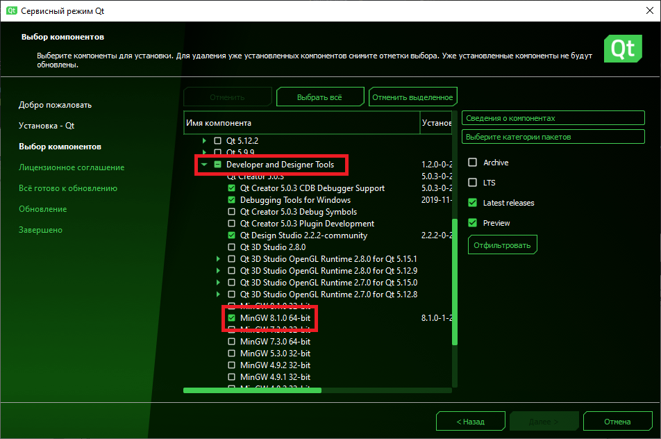

В Qt Creator перейдите к выбору проекта одним из следующих методов: 
- кнопка Open на стартовой странице или или
- File -> Open File or Project
- ```Ctrl + O```

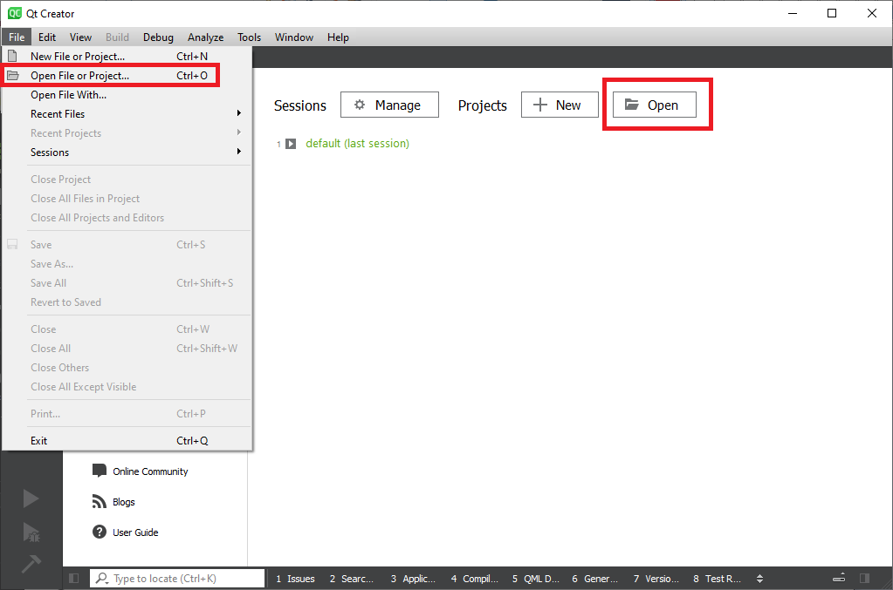

В открывшемся диалоге проводника выберите файл ```srg-api/srg-model/CMakeLists.txt```.

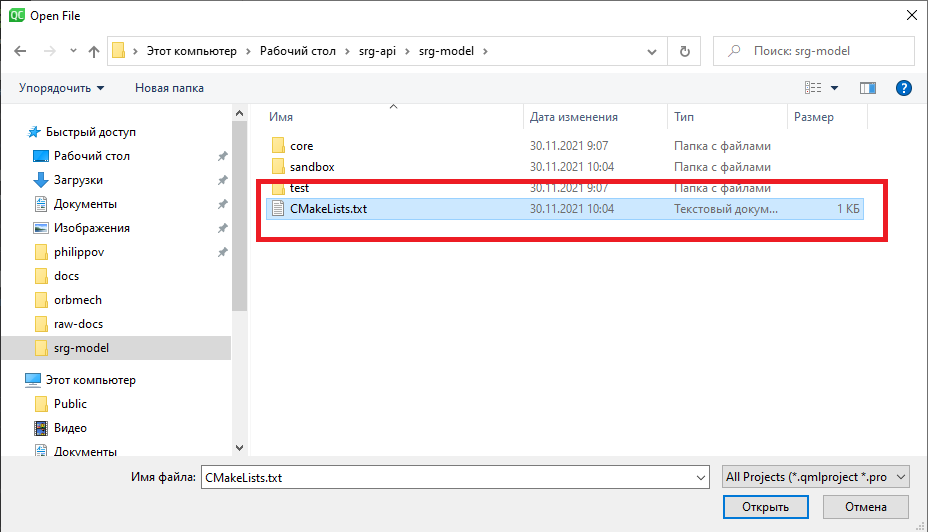

На открывшейся странице настройки проекта выберите любой доступный комплект сборки и нажите Configure Project. Версия библиотеки Qt может быть любой, так как в проекте она не используется.

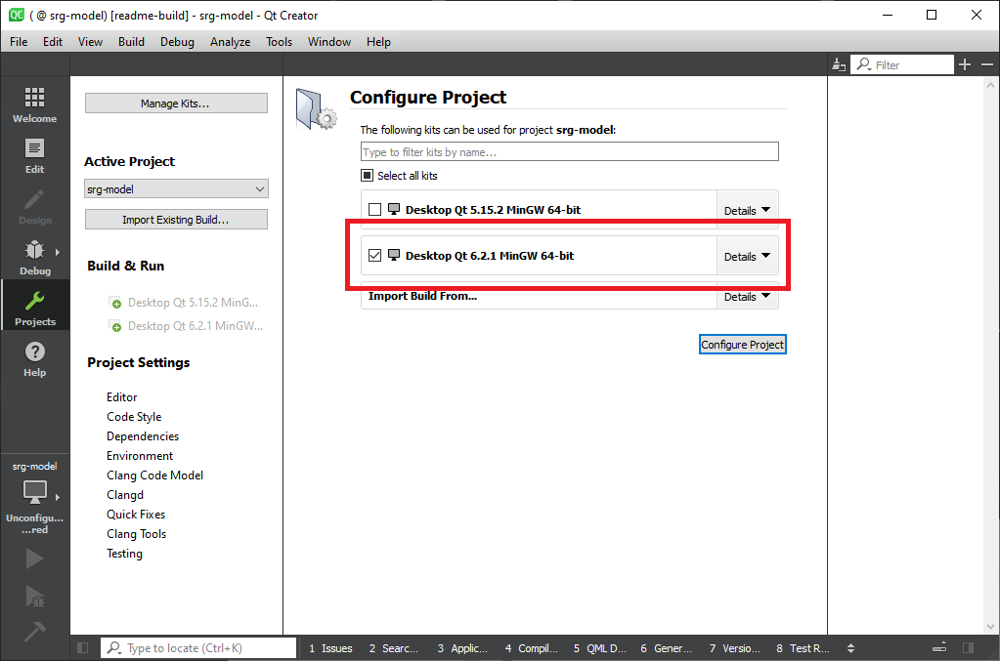

Изменить запускаемый файл (sandbox.exe или test.exe) можно на панели слева.

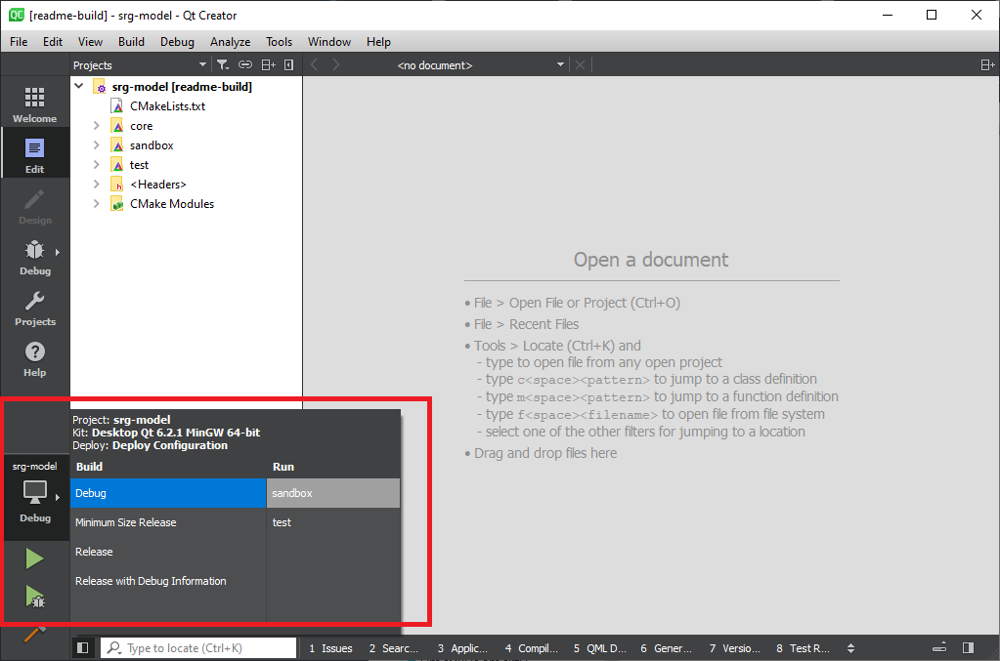

Для запуска тестов можно использовать специальную вкладку в Qt Creator. Для перехода к ней выберите вкладку Test Results на нижней панели.

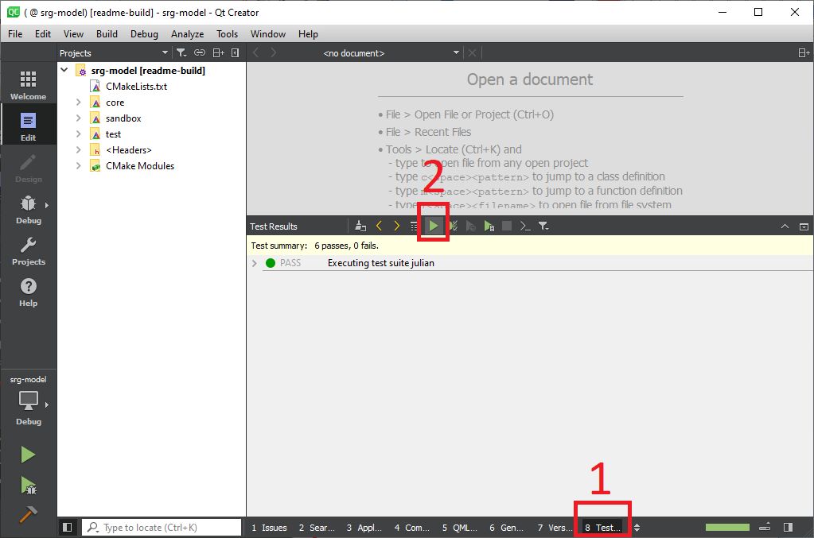

### Microsoft Visual Studio

В данном примере используется Visual Studio 2022.

При установке выберите комплект "Разработка классических приложения на C++" с дополнительным пакетом "SDK для Windows 10 (10.0.20348.0)". Данный дополнительный пакет нужен только в связке Windows 10 + Visual Studio 2022. Для Windows 7 или более ранних версий Visual Studio этот пакет не требуется.

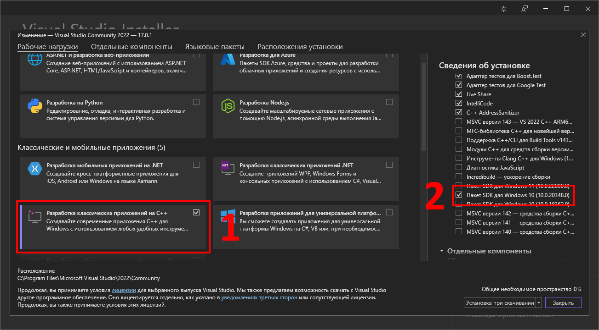

После установки запустите Visual Studio, в стартовом меню выберите "Открыть локальную папку". В открывшемся диалоге проводника выберите папку ```srg-api/srg-model```. Далее с проектом можно работать как с обычным проектом в Visual Studio.

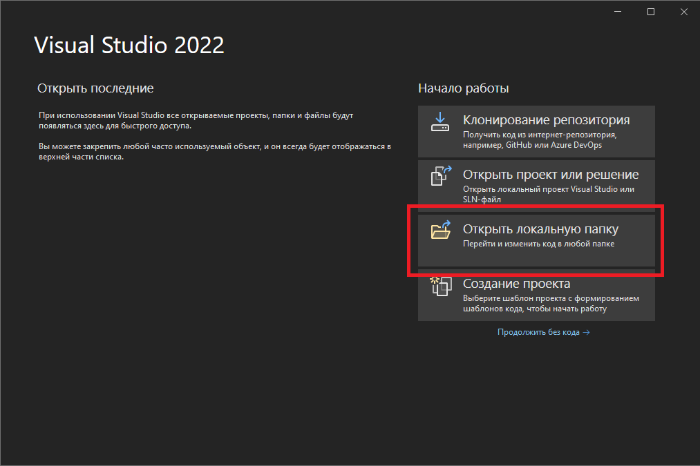

Изменить запускаемый файл (sandbox.exe или test.exe) можно на верхней панели.

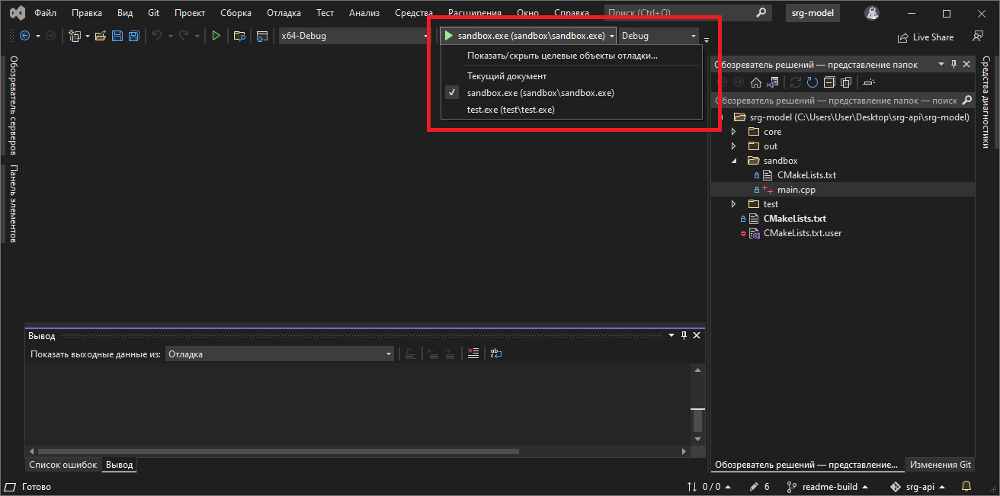

### Microsoft Visual Studio Code

Для сборки/запуска проекта в Visual Studio Code потребуется:
- предварительно установленный комплект компилятора Visual Studio (см. предыдущий пункт)
- расширение СMakeTools (Microsoft)
- расширение C/C++ (Microsoft)

Откройте директорию ```srg-api/srg-model``` в Visual Studio Code. Вероятно, что при первом запуске среда сама предложит установить необходимые расширения.

Выбор режима Debug/Rlease, комплекта компилятора, запускаемого приложения (sandbox.exe или test.exe), а также кнопки запуска приложения или его отладки производится на нижней панели.

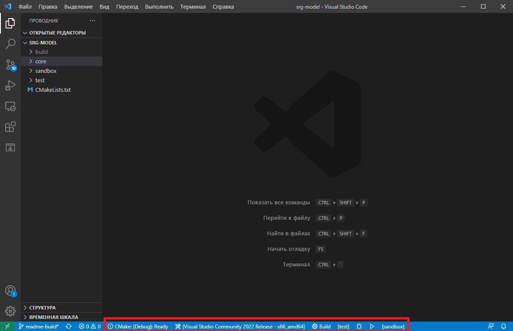

Набор горячих клавиш для работы с проектом CMake:

- ```F7``` - сборка выбранного приложения
- ```Shift + F7``` - сборка одного или всех приложений
- ```Shift + F5``` - запуск без отладки
- ```Ctrl + F5``` - запуск в режиме отладки

Изменить или посмотреть горячие клавиши можно пролистав список доступных действий для расширения CMake в Command Palette (```F1``` или ```Ctrl + Shift + P```).

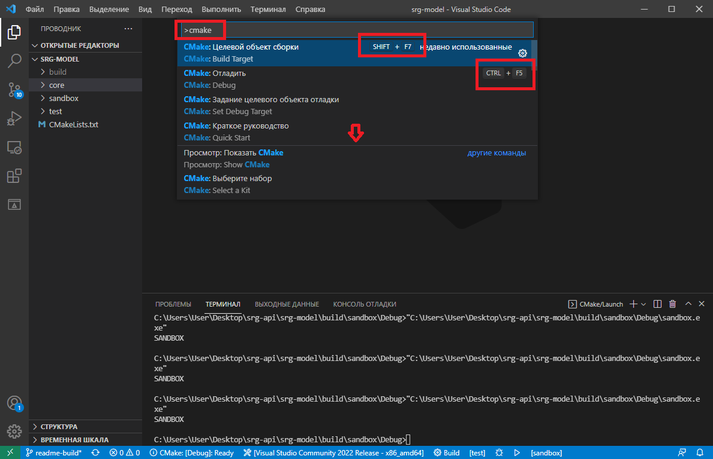


